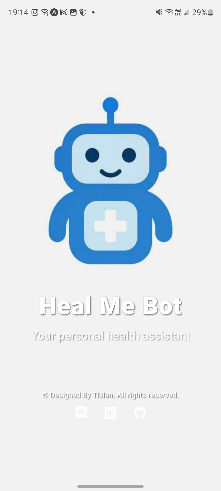
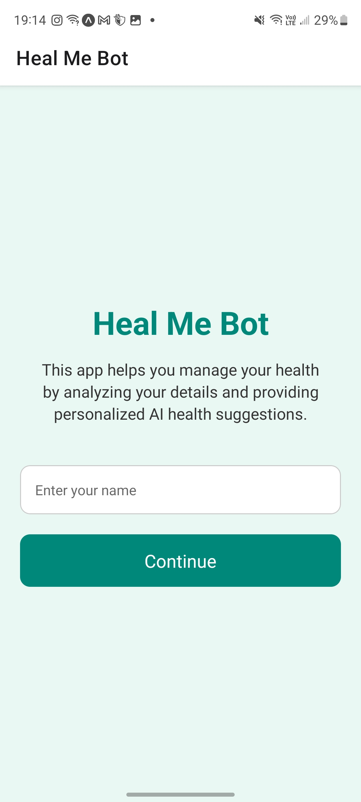
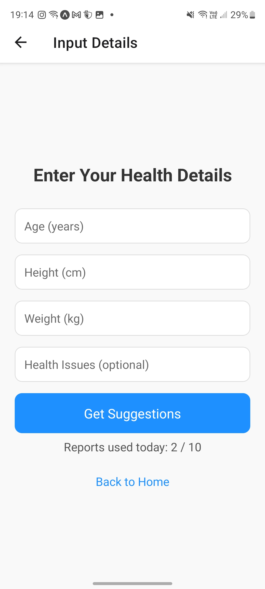
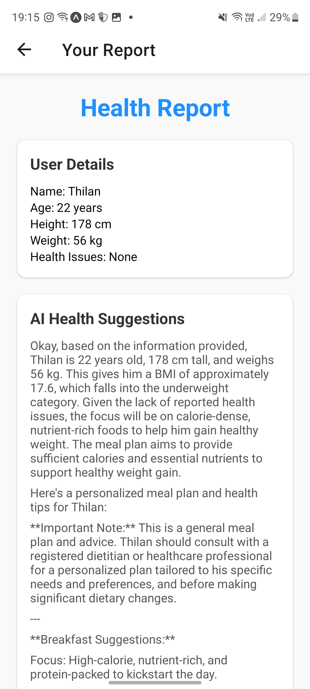
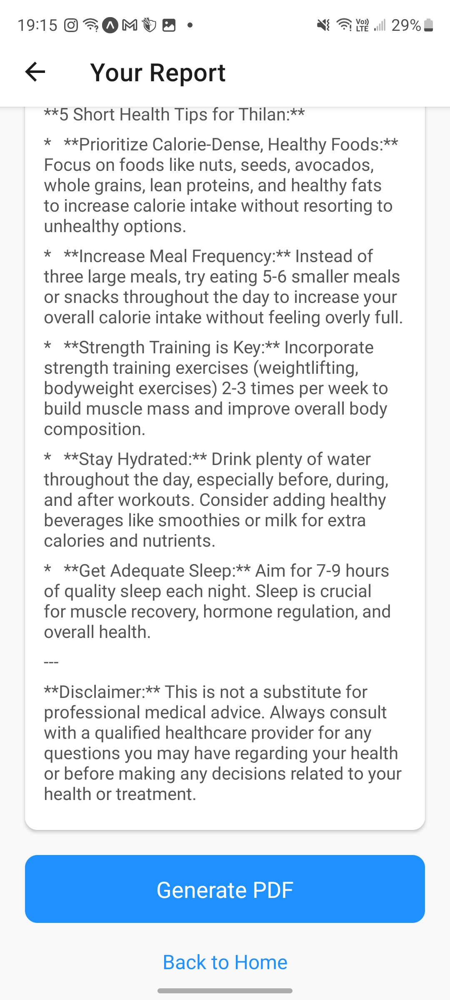
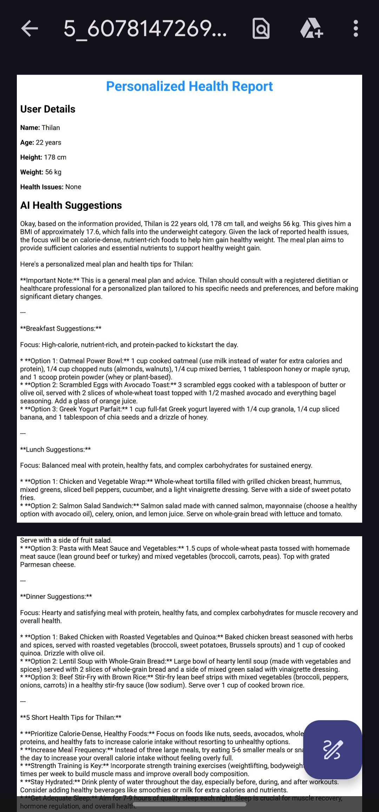

# Heal Me Bot

**🚫 Proprietary Project – All Rights Reserved**

This project, **Heal Me Bot**, including all code, assets, documentation, and associated materials, is the exclusive property of **Thilan Kalhara**.

You **MAY NOT**:

- Copy, reproduce, or distribute this project or its code  
- Modify, adapt, or create derivative works  
- Use it for commercial purposes  
- Claim it as your own  

without explicit written permission from the author.

For permissions or inquiries, contact: **thilanKalhara8@gmail.com**

---

## About

**Heal Me Bot** is a personal health assistant app that allows users to:

- Input personal health data (age, height, weight, health issues)  
- Receive AI-generated health and meal suggestions  
- Generate a personalized PDF health report for offline reference  

---

## Features

- **Personalized AI Suggestions** – Get health advice based on user metrics  
- **PDF Report Generation** – Save or share reports offline  
- **User Data Storage** – Store user name and preferences securely  
- **Daily usage limitations** – Users can generate up to **10 PDFs per day**  
- **Modern UI** – Splash screen, animated transitions, and user-friendly interface  
- **Social Links** – Connect via Discord, LinkedIn, or GitHub  

---

## Screenshots

### 🟦 Splash Screen
<p align="center">
  
</p>

### 🟩 Home Screen
<p align="center">
  
</p>

### 🟨 Input Screen
<p align="center">
  
</p>

### 🟧 Report Screen (1)
<p align="center">
  
</p>

### 🟪 Report Screen (2)
<p align="center">
  
</p>

### 🟥 PDF Save Option
<p align="center">
  
</p>

---

## Authors

[@Thilankalhara](https://github.com/Thilankalhara)

---

## License

See the [LICENSE](./LICENSE) file for full copyright and usage terms.

---

## Installation

1. **Clone the repository and set up the project**

```bash
# Clone the repository
gh repo clone Thilankalhara/healmebot-reactnative-javaee-Ai-healthCare-app
cd healmebot-reactnative-javaee-Ai-healthCare-app

# Configure environment variables
# Replace your local IP in .env (for backend)
# Add your Gemini API key in backend/GenerateSuggestions.java

# Install dependencies
npm install

# Run the project
npx expo start
